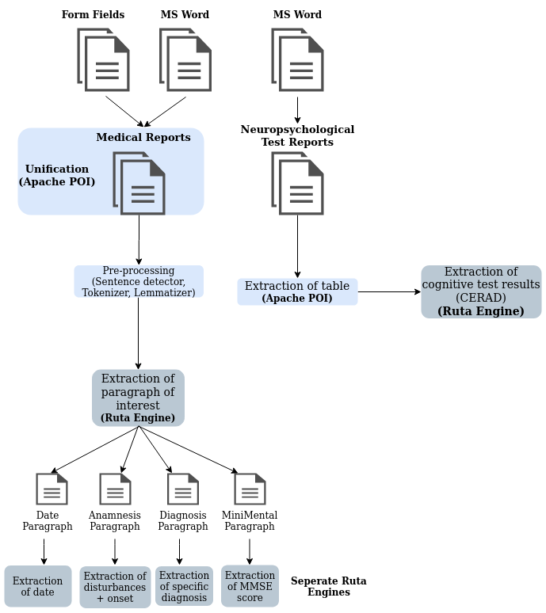

## MedEx: Information extraction from German medical reports in the context of Alzheimer's Disease

Whereas a number of data items are stored in machine readable formats such as structured entries in hospital information systems (HIS) or in additional Excel tables, additional valuable information is stored in text documents where information extraction is necessary. For this data, we set up modular rule-based text mining workflows requiring minimal sets of training data. These modules can be easily reused and adapted to further memory clinics settings.  
Because of a limited training data availability, the pipelines are baased on [UIMA Ruta](https://uima.apache.org/ruta.html).    
Due to data privacy, we can unfortunately not publish our data.  

## Pipeline overview 

### Preprocessing
The preprocessing includes some basic steps, including a sentence detector, a tokenizer and a lemmatizer. For both the sentence detector and the tokenizer, regular expressions were used, which can be found [here](/preprocessing). The lemmatizer is from the [*Mate tools*](https://www.ims.uni-stuttgart.de/en/research/resources/tools/matetools/). 

### Named Entity Recognition 
We solved all NER tasks with the help of [UIMA Ruta](https://uima.apache.org/ruta.html). The source code and further information can be found [here](/RutaRules) 

