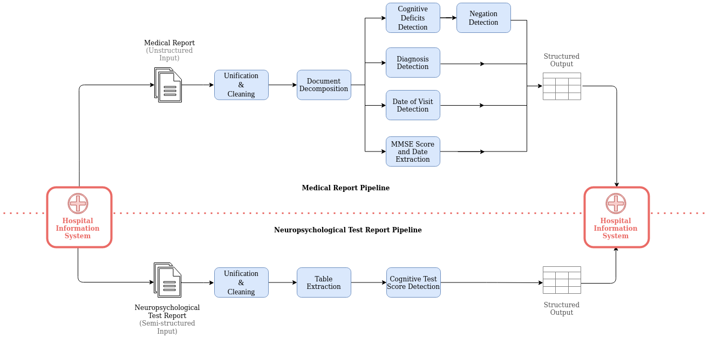

## MedEx: Information extraction from German medical reports in the context of Alzheimer's Disease

This repository contains the code for several distinct clinical text mining pipelines that were set up in the university hospital of Bonn, aiming to retrieve relevant information from German medical reports in the context of Alzheimer's Disease. Whereas a number of data items are stored in machine readable formats such as structured entries in hospital information systems (HIS) or in additional Excel tables, additional valuable information is stored in text documents where information extraction is necessary. For this data, we set up modular rule-based text mining workflows requiring minimal sets of training data. These modules can be easily reused and adapted to further memory clinics settings. All pipelines are baased on [UIMA Ruta](https://uima.apache.org/ruta.html).    
Due to data privacy, we can unfortunately not publish our data. However, we provide some synthetic data, written by a physician as well as our source code. 

## Pipeline overview 

## How to use
Clone the repository to your local folder: `git clone https://github.com/llangnickel/MedEx.git`   
and then change the directory: `cd MedEx`
  
As a first step, all documents need to be pre-processed, using a sentence detector, a tokenizer and a lemmatizer. For both the sentence detector and the tokenizer, regular expressions were used, which can be found [here](/config). The lemmatizer is from the [*Mate tools*](https://www.ims.uni-stuttgart.de/en/research/resources/tools/matetools/). 
  
We provide some medical reports, that can be run via the *Paragraph* pipeline.   
To preprocess the documents, run:  
`./preprocessing.sh example_data/paragraphs/ out_preprocessing`  
To annotate the different paragraphs, run:  
`./ruta.sh out_preprocessing out_paragraphs binary/RutaParagraphs.jar RutaRules/paragraphs/paragraphs.ruta`  
  
To annotate *disturbances* such as memory, language, attention or planning disturbances from the *anamesis* section, you can run:  
`./preprocessing.sh example_data/anamnesis/ out_anamnesis_pre` and  
`./ruta.sh out_anamnesis_pre/ out_anamnesis binary/RutaDisturbances.jar RutaRules/disturbances/disturbances.ruta`

